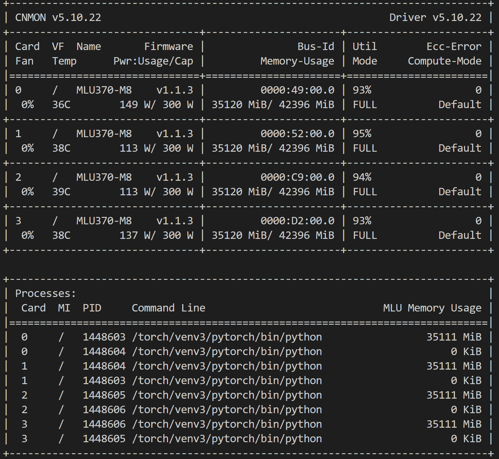

# MiniGPT4-on-MLU
将MiniGPT4移植到MLU370上，可以实现多卡训练和推理功能

## 环境配置
- 4 * MLU370 M8, MLULink互联
- Ubuntu20.04 LTS
- torch1.9 & python3.7.8

## 运行项目
### 准备
```shell
git clone https://github.com/gitover22/MiniGPT4-on-MLU.git
pip install -r requirements.txt
```

### 安装 fastchat
```shell
cd FastChat_mlu
pip3 install --upgrade pip && pip3 install -e .
```

### 下载模型
```shell
apt-get install git-lfs
# LLaMA-7b-hf模型下载
git lfs clone https://huggingface.co/decapoda-research/llama-7b-hf
# Vicuna 的 delta 权重下载
git lfs clone https://huggingface.co/lmsys/vicuna-7b-delta-v1.1
```


### 权重合并
```shell
# --base 和 --delta 的模型路径请根据实际位置配置
python3 -m fastchat.model.apply_delta \
    --base ./data/models/llama-7b-hf/ \
    --delta ./data/models/vicuna-7b-delta-v1.1/ \
    --target ./data/models/vicuna-7b-all-v1.1 \
    --low-cpu-mem
```

### 下载 miniGPT-4 预训练权重
```shell
wget https://huggingface.co/wangrongsheng/MiniGPT4-7B/resolve/main/prerained_minigpt4_7b.pth
```

### 数据集: cc_sbu_align
```shell
wget https://drive.google.com/u/0/uc?id=1nJXhoEcy3KTExr17I7BXqY5Y9Lx_-n-9&export=download
```

### 修改配置文件
```shell
# minigpt4/configs/models/minigpt4.yaml:
llama_model: "/home/zouguoqiang/MiniGPT4-on-MLU/data/models/vicuna-7b-all-v1.1"
# inference_configs/minigpt4_inference.yaml:
ckpt: "/home/zouguoqiang/MiniGPT4-on-MLU/data/models/prerained_minigpt4_7b.pth"
# minigpt4/configs/datasets/cc_sbu/align.yaml:
storage: "/home/zouguoqiang/MiniGPT4-on-MLU/data/datasets/cc_sbu_align/"
```

## 训练

训练配置文件: ./train_configs/minigpt4_stage2_finetune.yaml

```shell
./run_train.sh
```
训练中卡的状态:


## 推理

推理配置文件: ./inference_configs/minigpt4_inference.yaml

```shell
# 默认选择本地inference.jpg进行推理
./run_inference.sh
```

模型默认保存位置: output/minigpt4_stage2_finetune